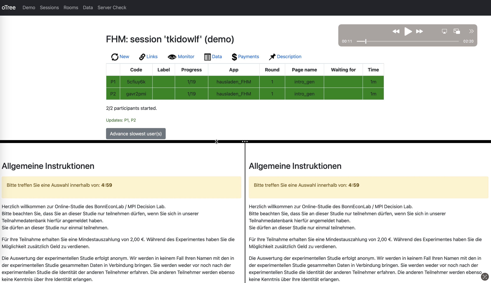

# PredictingCompliance
This repository provides the oTree and data analysis code to reproduce the paper's findings: "Predicting compliance: Leveraging chat data for supervised classification in experimental research".

If you use the data and or code provided by this repository, please cite the resource appropriately as follows: 

Hausladen, C. I., Fochmann, M., & Mohr, P. (2023, February 26). *Predicting Compliance: Leveraging Chat Data for Supervised Classification in Experimental Research*. Retrieved from [SSRN](https://ssrn.com/abstract=4371333)


# Structure

- `raw_data` contains raw data as outputted by oTree.
- `data` contains processed dataframes.
- `oTree_Experiment` contains code to rerun the behavioral experiment.
- `scr_py` contains Jupyter Notebooks and .html slides with code that trains and evaluates the honesty classifiers. Notebooks draw functions from `utils`.
- `scr_R` contains code that analyzes the chat data with respect to behavioral concepts.

# Running the oTree experiment

Follow these steps to run the experiment locally:

1. **Open a Terminal:** Open a new terminal window.

2. **Navigate to the Project Directory:** 

    ```bash
    cd oTree_experiment
    ```

3. **Activate the Virtual Environment:** If you've already created a virtual environment in your project directory called `venv`, you can activate it with the following command:

    ```bash
    source venv/bin/activate
    ```

    The terminal prompt should change to show that you're now working within the `venv` virtual environment.

4. **Install Dependencies:** Make sure that all required dependencies are installed in your virtual environment. 

    ```bash
    pip install -r requirements.txt
    ```

5. **Run the Server:** With the virtual environment activated and all dependencies installed, you can start the oTree server:

    ```bash
    otree devserver
    ```

    This will start the server, and you'll be able to access your experiment by opening a web browser and navigating to `http://localhost:8000/`.

A video demo of the experiment is available at 'oTree_Experiment/experiment_demo'.


# Running the analysis code

To run the analysis code, follow these steps:

1. **Install the Dependencies:** 

    ```bash
    pip install -r requirements.txt
    ```

2. **Download the Data Files:** Some data files (*.magnitude) are too large to be hosted on GitHub. You will need to download these files manually from the provided [polybox folder](https://polybox.ethz.ch/index.php/s/E05JCS37KfhbLB8).

    After downloading the files, move them into the `data` folder in your project directory. The analysis code is set up to read data from this folder.

